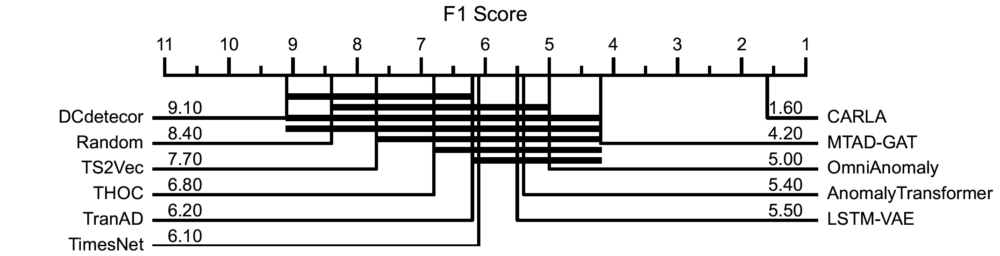
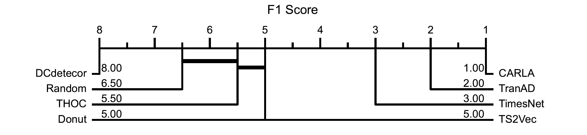
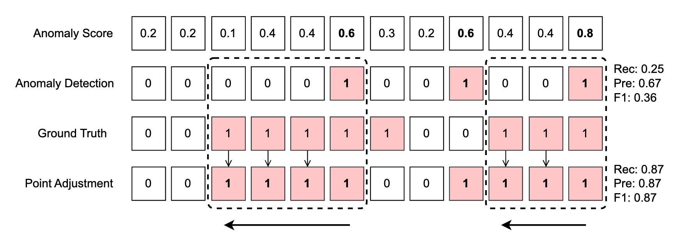

# CARLA: Self-supervised Contrastive Representation Learning for Time Series Anomaly Detection

[](https://paperswithcode.com/sota/time-series-anomaly-detection-on-msl?p=carla-a-self-supervised-contrastive)
[](https://paperswithcode.com/sota/time-series-anomaly-detection-on-smap?p=carla-a-self-supervised-contrastive)
[](https://paperswithcode.com/sota/time-series-anomaly-detection-on-smd?p=carla-a-self-supervised-contrastive)
[](https://paperswithcode.com/sota/time-series-anomaly-detection-on-kpi?p=carla-a-self-supervised-contrastive)
[](https://paperswithcode.com/sota/time-series-anomaly-detection-on-wadi?p=carla-a-self-supervised-contrastive)

_- **Updated at 2024-10-22** -_

This repository contains the source code for the research article "*[CARLA: Self-supervised Contrastive Representation Learning for Time Series Anomaly Detection](https://www.sciencedirect.com/science/article/pii/S0031320324006253)*" by 
- [Zahra Z. Darban](https://scholar.google.com/citations?user=wl6XsiwAAAAJ&hl=en) [Monash University], 
- [Geoffrey I. Webb](https://scholar.google.com/citations?user=_1tpf8AAAAAJ&hl=en) [Monash University], 
- [Shirui Pan](https://scholar.google.com/citations?user=frWRJN4AAAAJ&hl=en) [Griffith University], 
- [Charu C. Aggarwal](https://scholar.google.com/citations?user=x_wsduUAAAAJ&hl=en) [IBM], and 
- [Mahsa Salehi](https://scholar.google.com/citations?user=tTxJ1owAAAAJ&hl=en) [Monash University]


The code is implemented in Python using the PyTorch framework.

## Introduction / Model Architecture

Most time series anomaly detection models aim to learn normal behavior from unlabelled data, identifying anomalies as deviations from this behavior. However, the lack of labelled data makes it challenging to distinguish between normal and anomalous behaviors, often leading to high false positives when normal data slightly deviates from the defined normal boundary.

An alternative is self-supervised contrastive representation learning, which differentiates similar and dissimilar samples. This method has proven effective in image and natural language processing and is being explored in time series anomaly detection (TSAD). Contrastive learning helps separate normal and anomalous data, defining a clearer boundary for normal samples. However, current TSAD methods using contrastive learning may incorrectly classify augmented time series as negatives or distant windows as positives, reducing detection performance. A comparison of the anomaly score distribution is shown in the figure below. As demonstrated, the anomaly scores of both normal and anomalous data are blended together in existing approaches, resulting in the inefficacy of anomaly detection.


CARLA (Self-supervised **C**ontr**A**stive **R**epresentation **L**earning **A**pproach for time series Anomaly detection) addresses the lack of labelled data through a contrastive approach, which leverages existing generic knowledge about different types of time series anomalies [[1](https://arxiv.org/abs/2211.05244)] in the first stage (**Pretext**). We inject various types of anomalies through an **Anomaly Injection** process, which facilitates the learning representations of normal behaviour. This is achieved by encouraging the learning of similar representations for windows that are temporally closed windows while ensuring dissimilar representations for windows and their corresponding injected anomalous windows.

Additionally, to ensure that the representation of existing real anomalous windows (for which we do not have labels) is different from normal representations, we employ a **Self-supervised Classification** approach to classify normal/anomalous representations of windows based on their nearest/furthest neighbours in the representation space in the second stage (self-supervised classification). By making the normal representations more discriminative, we enhance the anomaly detection performance in our proposed model.


## Installation

To use the code, follow these steps:

1. Clone the repository:

```bash
git clone https://github.com/zamanzadeh/CARLA.git
cd CARLA
```

2. Create a virtual environment and activate it:

```bash
python -m venv carla-env
source carla-env/bin/activate # On Windows use `carla-env\Scripts\activate`
```

3. Install the required packages:

```bash
pip install -r requirements.txt
```

## Usage

### Where to set the datasets and find the results:

```
CARLA
|
|- datasets [datasets should be placed here]
|	|- MSL
|	|- KPI
|	| ...
|- results [find the results here]
|	|- MSL
|	|- KPI
|	| ...
```

### How to run the code:

To train and evaluate the model, use the following commands (Example: MSL dataset, entity M6):

#### To run the pretext stage:

```bash
carla_pretext.py --config_env configs/env.yml --config_exp configs/pretext/carla_pretext_msl.yml --fname M-6
```

#### To run the self-supervised classification stage:

```bash
carla_classification.py --config_env configs/env.yml --config_exp configs/classification/carla_classification_msl.yml --fname M-6
```

You can modify the `carla_pretext_msl.yml` and `carla_classification_msl.yml` files to adjust the model parameters, dataset paths, and other settings.

#### Example of running the end-to-end training and evaluation on MSL dataset:

```python
import os
import pandas

with open('datasets/MSL_SMAP/labeled_anomalies.csv', 'r') as file:
    csv_reader = pandas.read_csv(file, delimiter=',')
    
data_info = csv_reader[csv_reader['spacecraft'] == 'MSL']
for file_name in data_info['chan_id']:
    print(file_name)
    %run -i 'carla_pretext.py' --config_env configs/env.yml --config_exp configs/pretext/carla_pretext_msl.yml --fname $file_name
    %run -i 'carla_classification.py' --config_env configs/env.yml --config_exp configs/classification/carla_classification_msl.yml --fname $file_name
```

## Dataset

We evaluate the performance of the proposed model and compare the results across the seven most commonly used real benchmark datasets for Time Series Anomaly Detection (TSAD). All datasets, except Yahoo, have a predefined train/test split with unlabeled training data.

- **NASA Datasets** -- **Mars Science Laboratory (MSL)** and **Soil Moisture Active Passive (SMAP)** ([source](https://www.kaggle.com/datasets/patrickfleith/nasa-anomaly-detection-dataset-smap-msl)) are collected from NASA spacecraft and contain anomaly information from incident reports for a spacecraft monitoring system.

- **Server Machine Dataset (SMD)** ([source](https://github.com/NetManAIOps/OmniAnomaly/tree/master/ServerMachineDataset)) is gathered from 28 servers over 10 days, with normal data observed for the first 5 days and anomalies sporadically injected in the last 5 days.

- **Secure Water Treatment (SWaT)** ([source](https://itrust.sutd.edu.sg/testbeds/secure-water-treatment-swat/)) is data from a water treatment platform with 51 sensors over 11 days, including 41 anomalies deliberately generated over the last 4 days using a wide range of attacks.

- **Water Distribution Testbed (WADI)** ([source](https://itrust.sutd.edu.sg/testbeds/water-distribution-wadi/)) is data from a scaled-down urban water distribution system that included a combined total of 123 actuators and sensors. It covers a span of 16 days, including anomalies in the final two days.

- **Yahoo** ([source](https://webscope.sandbox.yahoo.com/catalog.php?datatype=s&did=70)) dataset consists of 367 hourly sampled time series with labels. We focus on the A1 benchmark, which includes "real" production traffic data from Yahoo properties in 67 univariate time series.

- **Key Performance Indicators (KPI)** ([source](https://github.com/NetManAIOps/KPI-Anomaly-Detection)) contains data on service and machine key performance indicators from real Internet company scenarios, including response time, page views, CPU, and memory utilization.


## Citation

If you use this code in your research, please cite the following article:

```bibtex
@article{darban2025carla,
  title={CARLA: Self-supervised contrastive representation learning for time series anomaly detection},
  author={Darban, Zahra Zamanzadeh and Webb, Geoffrey I and Pan, Shirui and Aggarwal, Charu C and Salehi, Mahsa},
  journal={Pattern Recognition},
  volume={157},
  pages={110874},
  year={2025},
  publisher={Elsevier}
}
```

# Appendix

## Appendix A - List of Symbols and Definitions

| **Symbol**  | **Definition** |
|-------------|----------------|
| $\mathcal{D}$ | Sequential time series windows where $\mathcal{D} = \{w_1, w_2, \dots, w_m\}$ |
| $w_i$        | $i^{th}$ window in $\mathcal{D}$ where $w_i = \{x_1, x_2, \dots, x_{WS}\}$ |
| $WS$         | Time series window size |
| $Dim$        | Number of dimensions in time series $\mathcal{D}$ |
| $m$          | Number of windows |
| $Q$          | Number of nearest/furthest neighbours |
| $a$          | Anchor sample (i.e. the original time series window) |
| $y$          | Number of temporally proximate windows |
| $p$          | Positive sample (i.e. random window selected from $y$ temporally proximate previous windows) |
| $n$          | Negative sample (i.e. anomaly injected window) |
| $(a, p, n)$  | Triplet in Pretext Stage |
| $\mathcal{T}$| All triplets set in Pretext Stage |
| $\alpha$     | Margin in pretext loss |
| $\phi_p$     | Pretext trained model |
| $\mathcal{B}$| All neighbours set |
| $\mathcal{N}$| $Q$-Nearest neighbours set |
| $\mathcal{F}$| $Q$-Furthest neighbours set |
| $\phi_s$     | Self-supervised trained model |
| $C_m$        | Majority class label |
| $\beta$      | Entropy loss weight |

## Appendix B - Critical difference of benchmark models

Critical difference diagrams for multivariate and univariate time series benchmark datasets.

  

  

## Appendix C - Results with Point Adjustment (PA)

A notable issue with many existing TSAD methods is their reliance on the point adjustment (PA) strategy [[2](https://dl.acm.org/doi/10.1145/3178876.3185996)], as used in TSAD literature like [[3](https://dl.acm.org/doi/10.1145/3292500.3330672)]. PA operates on the principle that if a segment is detected as anomalous, all previous segments in that anomaly subsequence are also considered anomalies (see **Figure C1**). Incorporating PA, the Random model outperform all state-of-the-art models, as depicted in **Table C1** and **Table C2**. 
% %PA was introduced under the assumption that a solitary alert during an anomaly phase is adequate to recover the system. It has evolved into a fundamental stage in the assessment of TSAD, with certain studies exclusively documenting $F1_{PA}$ without the conventional F1 score [[4](https://ojs.aaai.org/index.php/AAAI/article/view/20680)]. A higher $F1_{PA}$ is often interpreted as indicating better detection capability.


**Figure C1.** Impact of point adjustment (PA) on anomaly detection in time series. The figure represents a toy example using a sequence of 12 samples. Presents the anomaly scores for each sample within the sequence. The second row depicts the outcomes of anomaly detection using a threshold of 0.5 applied to all samples' anomaly scores. The third row provides the actual labels (ground truth) for the samples within the sequence. The fourth and final row presents the adjusted anomaly detection results using point adjustment with the ground truth. Evaluation metrics are calculated for both unadjusted and adjusted anomaly detection.

In Figure C1, for the unadjusted detection, we have True Positives (TP): 2, True Negatives (TN): 3, False Positives (FP): 1, False Negatives (FN): 6, yielding a Recall of 0.25, Precision of 0.67, and F1 score of 0.36. In contrast, the adjusted detection (in **bold** for emphasis) resulted in TP: 7, TN: 3, FP: 1, and FN: 1, giving a significantly improved Recall of 0.875, Precision of 0.875, and F1 score of 0.875. This illustrates the substantial difference in evaluation results due to the application of PA in the anomaly detection process. It is evident that the point adjustment greatly enhances the performance of anomaly detection. 

% However, PA carries a notable peril of inflating the performance of the model. In most of the TSAD models, an anomaly score is produced to indicate the degree of abnormality, and the model detects a given point as an anomaly when the score surpasses a threshold. Incorporating PA, the predictions based on the model that randomly generated anomaly scores uniformly outperform all state-of-the-art models. It becomes challenging to assert that a model with a superior $F1_{PA}$ performs better than a model with a lower $F1_{PA}$ when random anomaly scores have the potential to result in a high $F1_{PA}$ comparable to that of a proficient detection model. Experimental results in Tables C1 and C2 demonstrate that the random anomaly score model can outperform all state-of-the-art models, highlighting the limitations of relying solely on $F1_{PA}$ for model evaluation.
  
#### Table C1: Precision ($Prec_{PA}$), recall ($Rec_{PA}$), and ($F1_{PA}$) results with point adjustment (PA) for various models on multivariate time series datasets.
| Model | Metric | MSL | SMAP | SMD | SWaT | WADI |
|----------------|--------------|-------|-------|-------|-------|-------|
| LSTM-VAE | $Prec_{PA}$ | 0.8049 | 0.6755 | 0.7765 | 0.9745 | 0.0639 |
| | $Rec_{PA}$ | 0.8394 | 0.9358 | 0.8740 | 0.7036 | 1.0000 |
| | $F1_{PA}$ | 0.8218 | 0.7848 | 0.8224 | 0.8172 | 0.1202 |
| OmniAnomaly | $Prec_{PA}$ | 0.8241 | 0.6931 | 0.8193 | 0.9861 | 0.2685 |
| | $Rec_{PA}$ | 0.9859 | 0.9754 | 0.9531 | 0.7864 | 0.9686 |
| | $F1_{PA}$ | 0.8978 | 0.8104 | 0.8811 | 0.8750 | 0.4204 |
| MTAD-GAT | $Prec_{PA}$ | 0.4305 | 0.7561 | 0.4106 | 0.9720 | 0.2553 |
| | $Rec_{PA}$ | 0.9953 | 0.9957 | 0.9370 | 0.6857 | 0.9941 |
| | $F1_{PA}$ | 0.6011 | 0.8595 | 0.5710 | 0.8052 | 0.4062 |
| THOC | $Prec_{PA}$ | 0.8291 | 0.5741 | 0.3819 | 0.7854 | 0.3871 |
| | $Rec_{PA}$ | 0.9651 | 0.9324 | 0.8946 | 0.9774 | 0.7638 |
| | $F1_{PA}$ | 0.8919 | 0.7106 | 0.5353 | 0.8709 | 0.5138 |
| AnomalyTran | $Prec_{PA}$ | 0.7201 | 0.6481 | 0.8058 | 0.9087 | 0.0642 |
| | $Rec_{PA}$ | 0.9832 | 0.9258 | 0.8482 | 0.7735 | 1.0000 |
| | $F1_{PA}$ | 0.8313 | 0.7625 | 0.8265 | 0.8357 | 0.1207 |
| TranAD | $Prec_{PA}$ | 0.8911 | 0.8644 | 0.8043 | 0.5207 | 0.0639 |
| | $Rec_{PA}$ | 0.9953 | 0.9976 | 0.9374 | 0.7779 | 1.0000 |
| | $F1_{PA}$ | 0.9403 | 0.8906 | 0.9168 | 0.6238 | 0.1202 |
| TS2Vec | $Prec_{PA}$ | 0.2152 | 0.2605 | 0.1800 | 0.1718 | 0.0893 |
| | $Rec_{PA}$ | 1.0000 | 1.0000 | 0.9950 | 1.0000 | 1.0000 |
| | $F1_{PA}$ | 0.3542 | 0.4133 | 0.3050 | 0.2932 | 0.1639 |
| DCdetector | $Prec_{PA}$ | 0.4972 | 0.5648 | 0.6359 | 0.6998 | 0.2257 |
| | $Rec_{PA}$ | 1.0000 | 0.9905 | 0.8110 | 0.9125 | 0.9263 |
| | $F1_{PA}$ | 0.6642 | 0.7194 | 0.7128 | 0.7921 | 0.3630 |
| TimesNet | $Prec_{PA}$ | 0.7547 | 0.6015 | 0.7962 | 0.8421 | 0.3742 |
| | $Rec_{PA}$ | 0.9765 | 0.9822 | 0.9265 | 1.0000 | 0.9127 |
| | $F1_{PA}$ | 0.8514 | 0.7461 | 0.8560 | 0.9174 | 0.5308 |
| Random | $Prec_{PA}$ | 0.1746 | 0.9740 | 0.8670 | 0.9398 | 0.8627 |
| | $Rec_{PA}$ | 1.0000 | 1.0000 | 0.9686 | 0.9331 | 0.9732 |
| | $F1_{PA}$ | **0.9840** | **0.9869** | **0.9150** | **0.9364** | **0.9146** |
| CARLA | $Prec_{PA}$ | 0.8545 | 0.7342 | 0.6757 | 0.9891 | 0.1971 |
| | $Rec_{PA}$ | 0.9650 | 0.9935 | 0.8465 | 0.7132 | 0.7503 |
| | $F1_{PA}$ | 0.9064 | 0.8444 | 0.7515 | 0.8288 | 0.3122 |

##### Table C2: Precision ($Prec_{PA}$), recall ($Rec_{PA}$), and ($F1_{PA}$) results with point adjustment (PA) for various models on univariate time series datasets.

| Model          | Metric       | Yahoo-A1 | KPI   |
|----------------|--------------|----------|-------|
| Donut          | Prec<sub>PA</sub> | 0.5252   | 0.3928 |
|                | Rec<sub>PA</sub>  | 0.9280   | 0.5797 |
|                | F1<sub>PA</sub>   | 0.6883   | 0.4683 |
| THOC           | Prec<sub>PA</sub> | 0.3138   | 0.3703 |
|                | Rec<sub>PA</sub>  | 0.9723   | 0.9154 |
|                | F1<sub>PA</sub>   | 0.4745   | 0.5273 |
| TranAD         | Prec<sub>PA</sub> | 0.5722   | 0.7012 |
|                | Rec<sub>PA</sub>  | 0.9858   | 0.7528 |
|                | F1<sub>PA</sub>   | 0.7241   | 0.7261 |
| TS2Vec         | Prec<sub>PA</sub> | 0.4993   | 0.4514 |
|                | Rec<sub>PA</sub>  | 0.9717   | 0.9058 |
|                | F1<sub>PA</sub>   | 0.6597   | 0.6025 |
| DCdetector     | Prec<sub>PA</sub> | 0.0750   | 0.2758 |
|                | Rec<sub>PA</sub>  | 0.7653   | 0.8380 |
|                | F1<sub>PA</sub>   | 0.1366   | 0.4151 |
| TimesNet       | Prec<sub>PA</sub> | 0.6232   | 0.5185 |
|                | Rec<sub>PA</sub>  | 0.8865   | 0.6133 |
|                | F1<sub>PA</sub>   | 0.7319   | 0.5619 |
| Random         | Prec<sub>PA</sub> | 0.9020   | 0.6540 |
|                | Rec<sub>PA</sub>  | 0.9911   | 0.8986 |
|                | F1<sub>PA</sub>   | **0.9445** | **0.7570** |
| CARLA          | Prec<sub>PA</sub> | 0.7475   | 0.3980 |
|                | Rec<sub>PA</sub>  | 0.9984   | 0.8933 |
|                | F1<sub>PA</sub>   | 0.8549   | 0.5507 |


## License

This project is licensed under the MIT License - see the [LICENSE](LICENSE) file for details.
